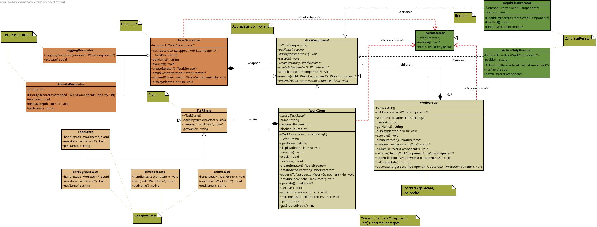
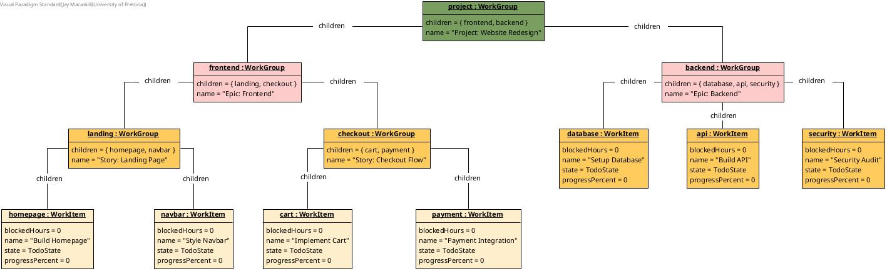
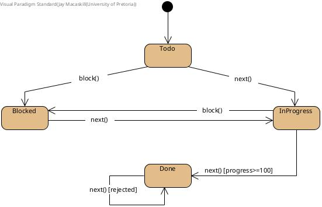
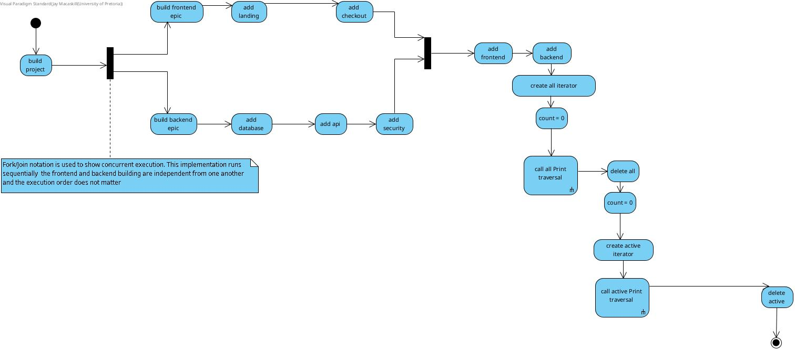
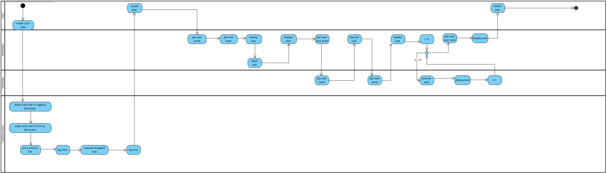

# 📋 TaskForge — Hierarchical Work Processing Engine

COS 214 Practical 4 — *TaskForge: Hierarchical Work Processing*

<p align="center">
  
</p>

---

## 👥 Team

| Name | Student Number |
|---|---|
| Amira Ajanaku | 25111699 |
| Senzo Lukhele | 24691497 |
| Jay Macaskill | 25198387 |

---

## 🏗️ System Concept

**TaskForge** models a software delivery hierarchy — Projects contain Epics, Epics contain Tasks,
and Tasks can also stand alone. Every Task moves through a lifecycle (`Todo → InProgress →
Blocked → Done`), can be decorated with extra responsibilities at runtime (priority, logging), and
the whole tree can be traversed either completely or filtered down to just what's still active.

### Example structure

```
Project: Website Redesign
├── Epic: Frontend
│   ├── Story: Landing Page
│   │   ├── Build Homepage
│   │   └── Style Navbar
│   └── Story: Checkout Flow
│       ├── Implement Cart
│       └── Payment Integration
└── Epic: Backend
    ├── Setup Database
    ├── Build API
    └── Security Audit
```

---

## 🧩 Design Patterns

TaskForge is built around four collaborating GoF patterns:

- **Composite** — `WorkComponent` is the common interface, `WorkItem` the Leaf (a single Task),
  `WorkGroup` the Composite (a Project or Epic). Groups and items are traversed and executed
  uniformly, no matter how deep the nesting.

- **State** — each `WorkItem` owns a `TaskState`, and behaviour (`execute()`, valid transitions)
  is delegated to whichever concrete state (`Todo`/`InProgress`/`Blocked`/`Done`) currently applies,
  instead of conditionals inside `WorkItem` itself.

- **Decorator** — `TaskDecorator` wraps a `WorkComponent` to add responsibilities at runtime.
  `PriorityDecorator` and `LoggingDecorator` can be stacked, and the outermost decorator owns
  everything it wraps.

- **Iterator** — `DepthFirstIterator` walks the whole tree; `ActiveOnlyIterator` walks only
  non-Done tasks. Both are **snapshot iterators**: the tree is flattened once at construction, so
  a structural change mid-traversal is simply not reflected in an iterator already built.

---

## 📐 Diagrams

<p align="center">
  
  <br/>
  <sub><em>UML class diagram — click <a href="practicals/practical_4/img/class.jpg">here</a> to view full size</em></sub>
</p>

<p align="center">
  
  <br/>
  <sub><em>Object diagram — a runtime slice of the Project hierarchy</em></sub>
</p>

<p align="center">
  
  <br/>
  <sub><em>State diagram — the Task lifecycle</em></sub>
</p>

<p align="center">
  
  <br/>
  <sub><em>Activity diagram — adding and traversing tasks</em></sub>
</p>

<p align="center">
  
  <br/>
  <sub><em>Activity diagram — state transition with guard conditions</em></sub>
</p>

<p align="center">
  
  <br/>
  <sub><em>Activity diagram — decorating and notifying, with a fork/join and swimlanes</em></sub>
</p>

---

---

## 🐳 Docker

<p align="center">
  
</p>

No local dependencies are required — the provided `Dockerfile` gives you `g++`, `make`, `gdb` and
`valgrind` in a single container.

**Build the image:**
```bash
docker build -t taskforge-image .
```

**Run the program:**
```bash
docker run --rm -it taskforge-image
```

**Debug with GDB** (drop into a shell instead of running directly):
```bash
docker run --rm -it taskforge-image bash
gdb ./taskforge
```

**Check for memory leaks with Valgrind:**
```bash
docker run --rm -it taskforge-image bash
valgrind --leak-check=full --show-leak-kinds=all ./taskforge
```

**Rebuild after making source changes:**
```bash
docker build -t taskforge-image .
```

## 🛠️ Building

This project targets **C++11** and is built with the provided `Makefile`.

```bash
make
```

This produces two executables:

```
taskforge   # the main workflow demonstration
demo        # standalone, interactive pattern demonstrations
```

To clean build artefacts:

```bash
make clean
```

---

## ▶️ Running

```bash
./taskforge
```

Builds a project hierarchy, runs two independent traversals, stacks decorators on a task, walks a
task through its full lifecycle (including an invalid transition), moves a task between groups at
runtime, and shows a snapshot iterator remaining unaffected by that move — finishing with a full
cascading cleanup of the hierarchy.

```bash
./demo
```

Runs each pattern in interactively for inspection.

---

## 🧪 Debugging

```bash
make valgrind        # runs taskforge under Valgrind
make valgrind-demo    # runs demo under Valgrind
```

GDB can be attached the usual way, e.g. `gdb ./taskforge`.

---

## 🔀 GitHub Workflow

<p align="center">
  
</p>

This repository was used throughout development by all three team members, with commit history
reflecting ongoing, divided work rather than a single end-of-practical upload.